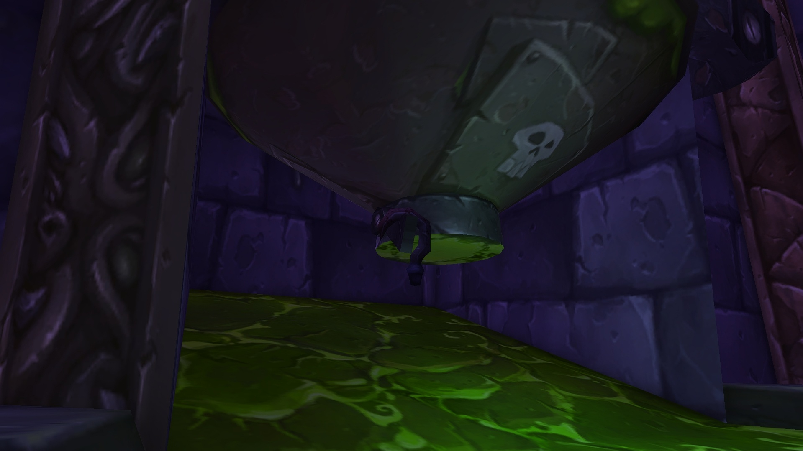

# 纳克萨玛斯T3套装

## 解锁NAXX的东瘟疫之地特殊传送门之后进入纳克萨玛斯（10人/25人均可）
---
## 制作抓钩（3个零件）
---
- 法琳娜的针线包
- 纳克萨玛斯首领**黑女巫法琳娜**掉落法琳娜的针线包
---
- 构造体之钩
构造区右侧第二个房间内，挂在粘液罐下方。
- 

---
- 憎恶之链
- 在纳克萨玛斯副本内的软泥(绿水)中钓鱼获得。
---
## 唤醒扎凯特·碎颅者
- 携带 **[斯坦索姆圣水]** (斯坦索姆地下城内散落的箱子中开出，如果提前准备好 **[花钱保方便]** 任务需要物品携带一瓶，否则携带两瓶)
- 前往纳克萨玛斯构造区 **[塔迪乌斯]** (尾王)房间
- 

- 

- 上到台子上后用 **[斯坦索姆圣水]** 泼醒扎凯特·碎颅者

## [花钱保方便]
- 接到任务 **[花钱保方便]** 任务需要物品
-- **[侵略者的天灾石]** X 20  (通灵学院/斯坦索姆天灾区的BOSS掉落)
-- **[堕落者的天灾石]** X 5  (NAXX的BOSS掉落)
-- **[黑暗符文]** X 3  (通灵学院/东瘟疫之地的考林路口怪物掉落，或者拍卖行购买)
-- **[黑咖啡]** X 1 (暴风城热咖啡商人 **特拉维斯·尼古拉斯[69.2 65.4]** 、达萨罗 **尤雅恩[48.2 90.6]** 出售)
- 交还任务后会获得一件当前职业可用的 **[被亵渎的护腕]**
- 并且**[扎凯特·碎颅者]** 会出现在纳克萨玛斯副本内的入口处出手物品。

## [扎凯特·碎颅者]出售商品列表
| 序号 | 物品 | 价格 | 备注 |
| --- | --- | --- | --- |
1 | 劫掠者的凹陷头盔 | 3x死神的谈判筹码 | 擦除尘埃和污垢，随机揭示出一件来自卡利姆多或东部王国的头部栏位物品，几率开出追思十字军的头盔
2 | 劫掠者的凹陷肩甲 | 3x死神的谈判筹码 | 擦除尘埃和污垢，随机揭示出一件来自卡利姆多或东部王国的肩部栏位物品，几率开出追思十字军的肩甲
3 | 劫掠者的凹陷胸甲 | 3x死神的谈判筹码 | 擦除尘埃和污垢，随机揭示出一件来自卡利姆多或东部王国的胸部栏位物品，几率开出追思十字军的胸甲
4 | 劫掠者的凹陷护腕 | 3x死神的谈判筹码 | 擦除尘埃和污垢，随机揭示出一件来自卡利姆多或东部王国的手腕栏位物品，几率开出追思十字军的护腕
5 | 劫掠者的凹陷护手 | 3x死神的谈判筹码 | 擦除尘埃和污垢，随机揭示出一件来自卡利姆多或东部王国的手部栏位物品，几率开出追思十字军的护手
6 | 劫掠者的凹陷腰带 | 3x死神的谈判筹码 | 擦除尘埃和污垢，随机揭示出一件来自卡利姆多或东部王国的腰部栏位物品，几率开出追思十字军的腰带
7 | 劫掠者的凹陷绑腿 | 3x死神的谈判筹码 | 擦除尘埃和污垢，随机揭示出一件来自卡利姆多或东部王国的腿部栏位物品，几率开出追思十字军的护腿
8 | 劫掠者的凹陷靴子 | 3x死神的谈判筹码 | 擦除尘埃和污垢，随机揭示出一件来自卡利姆多或东部王国的脚部栏位物品，几率开出追思十字军的靴子
9 | 覆盖着粘液的卷轴 | 12x死神的谈判筹码 | 随机揭示一个来自纳克萨玛斯的远古配方
10 | 护命之纹 | 2000金币 | 制作T3装备所需材料
11 | 天灾谷物 | 15x死神的谈判筹码 | 玩具，放置一个普普通通的谷物箱子
12 | 腐烂美味 | 30x死神的谈判筹码 | 用于获取坐骑：英勇的缰绳
13 | 图样：咒怨布 | 20x死神的谈判筹码 | 用于制作T3布甲，需要完成成就“死亡诱惑”
14 | 图样：凌虐之皮 | 20x死神的谈判筹码 | 用于制作T3皮甲，需要完成成就“死亡诱惑”
15 | 图样：天灾之鳞 | 20x死神的谈判筹码 | 用于制作T3锁甲，需要完成成就“死亡诱惑”
16 | 设计图：死灵合金 | 20x死神的谈判筹码 | 用于制作T3板甲，需要完成成就“死亡诱惑”

---

