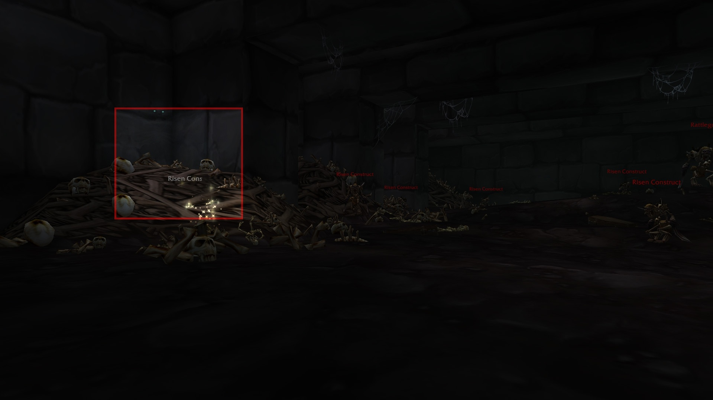
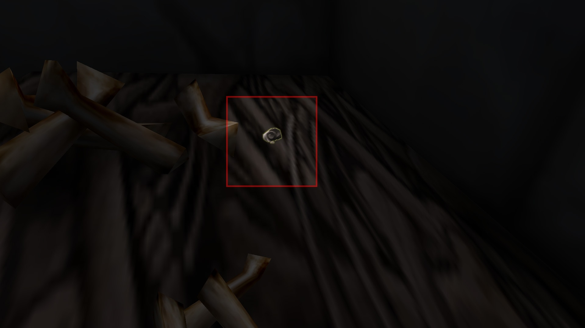
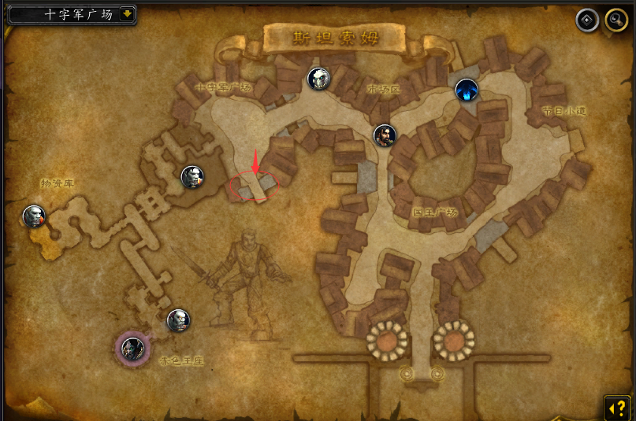
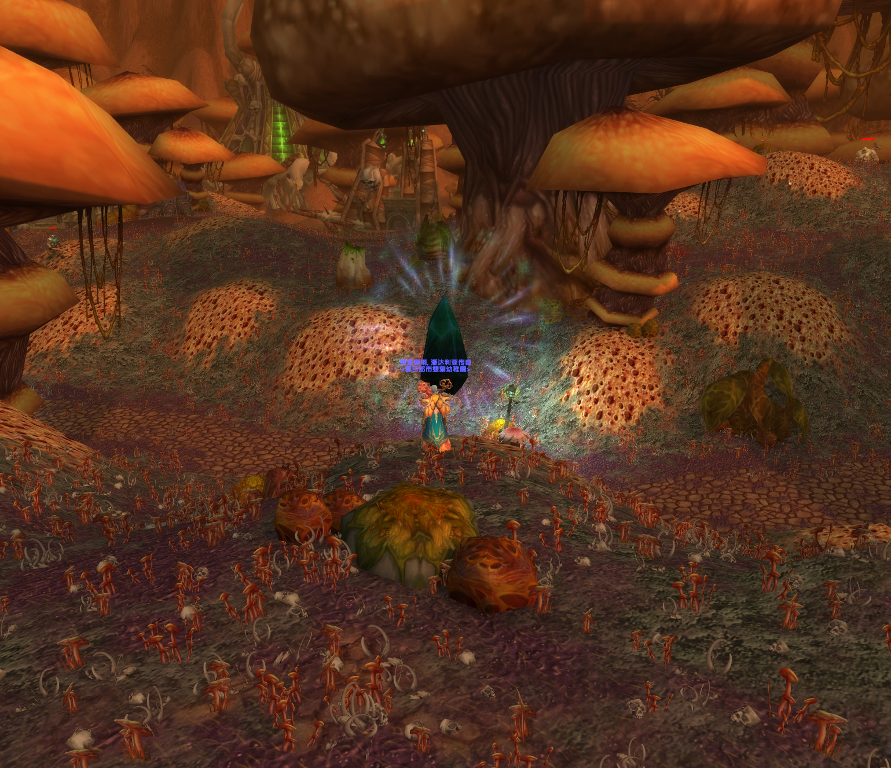
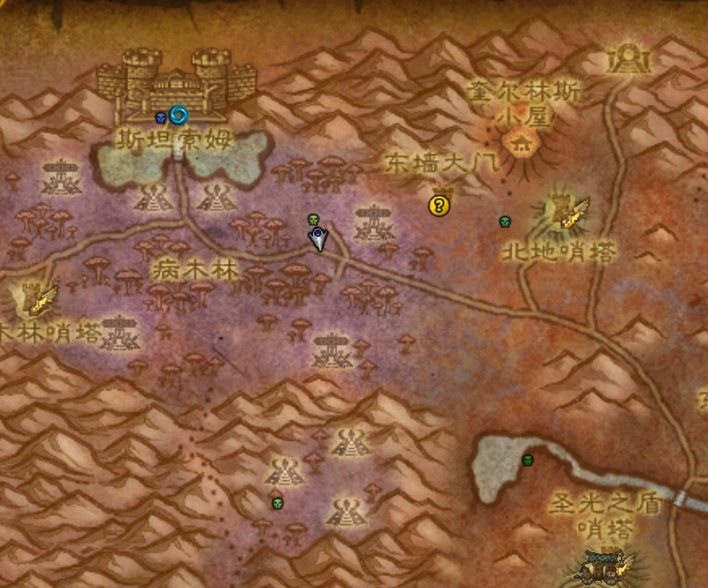

# 纳克萨玛斯解密

## Step 1

- 需要解锁旧通灵学院

- 进入旧通灵学院，来到首领血骨傀儡所在位置，在血骨傀儡所在房间入口左侧的骨堆上寻找并拾取 **[开裂的银色黎明委任徽章]** 。

- 早年间完成过纳克萨玛斯旧任务线的玩家可能无法看到开裂的银色黎明委任徽章。
如果遇到这种情况可与寒风营地 **西瘟疫之地 [42.8 83.8]** 的银色黎明军需官莱斯巴克、亡灵壁垒 **提瑞斯法林地 [83.2 68.0]** 的银色黎明军需官哈萨等NPC对话直接获取银色黎明委任徽章。

- 

- 

---

## Step2

- 拍卖行或者自己制造刷怪获得 **[正义宝珠]** X1和 **[真银锭]** X4，修复 **[开裂的银色黎明委任徽章]** ，获得饰品 **[银色黎明委任徽章]** 。

---

## Step3

- 装备 **[银色黎明委任徽章]** ，进入旧通灵学院击杀 **[黑暗院长加丁]** ，获得 **[黑暗院长的天灾石]** ，并触发任务交给东瘟疫之地圣光之愿礼拜堂旅店后面的尼古拉斯·瑟伦霍夫公爵。
- 完成任务将为账号中的所有角色解锁在装备 **[银色黎明委任徽章]** 时获得 **[侵略者的天灾石]** 的能力。

---

## Step4

- 正门进入斯坦索姆，通过路边的箱子收集一个 **[斯坦索姆圣水]** 。

- 在副本中找到潜行的 **[纳克萨玛斯之眼]** 并拾取 **[纳克萨玛斯的结界]**。

- 前往下图位置。

- 

- 使用 **[纳克萨玛斯的结界]** ，获得持续2分钟的buff **[洞察真视]** 。再用 **[斯坦索姆圣水]** 泼洒结界，获得持续5分钟的debuff **[手法娴熟]** 。

---

## Step4

在debuff持续的5分钟内经节日小道前往天灾军团侧，快速击杀3个通灵塔boss和镇长进入屠杀广场，并击杀最终boss。

---

## Step5

- 击杀最终boss后 **[纳克萨玛斯之手]** 会出现在刷新数波小怪的大门内，靠近后会出现额外技能按钮，使用后将其烧成灰烬。

---

## Step6

- 返回圣光之愿礼拜堂，与旅店门口的大法师安吉拉·杜萨图斯交谈，会根据银色黎明阵营声望解锁纳克萨玛斯解密内容的任务

#### **尊敬**
-  **[奥术水晶]** X 5
- **[大块魔光碎片]** X 2 
- **[正义宝珠]** X 1

#### **崇敬**

- **[奥术水晶]** X 2
- **[大块魔光碎片]** X 3

#### **崇拜**
- 崇拜无需上交材料，可直接完成任务，即可解锁纳克萨玛斯的远古秘密。可以通过击杀旧版通灵学院、斯坦索姆、纳克萨玛斯的BOSS获取堕落者的天灾石等兑换货币，并解锁**纳克萨玛斯在东瘟疫之地**的特殊入口 **[35.7 23.0]。

- 

- 

---
